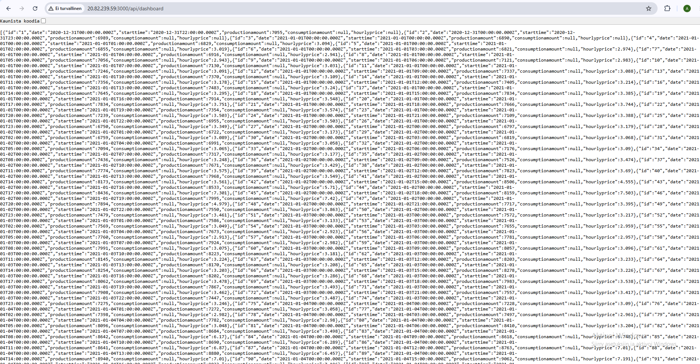
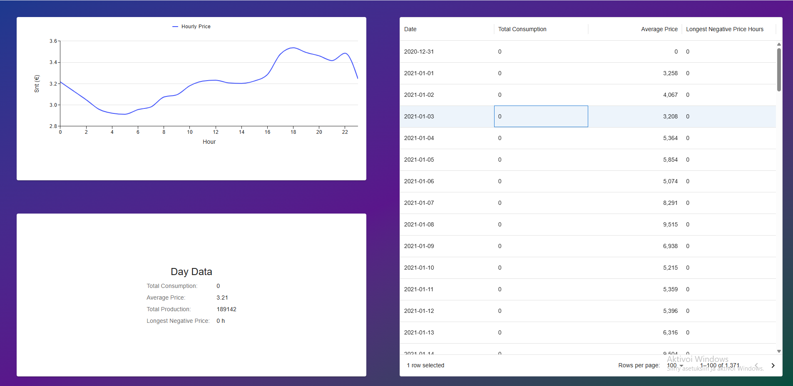

# Dev Academy Autumn 2026 Exercise

This project contains the backend and frontend services for the application. Make sure you have Docker and Node.js installed on your machine before getting started.

> **Note:** This project allows you to run both the REST API and the database locally as well as in the Azure cloud environment.


## 🚀 Setup & Installation

Follow these steps to set up and run the application in your local development environment.

### 1. Initialize Backend & Database
Run the following commands starting from the project root (`backend/dev-academy-autumn-2026-exercise/`):

```bash
# Start Docker containers (forces build and renews anonymous volumes)
docker compose up --build --renew-anon-volumes -d

# Navigate to the backend directory, execute setup scripts, and install dependencies
cd backend
sh commands.sh
npm install
cd ..


## 📸 Proof of Deployment & Interface

### Azure Cloud REST API


### User Interface
